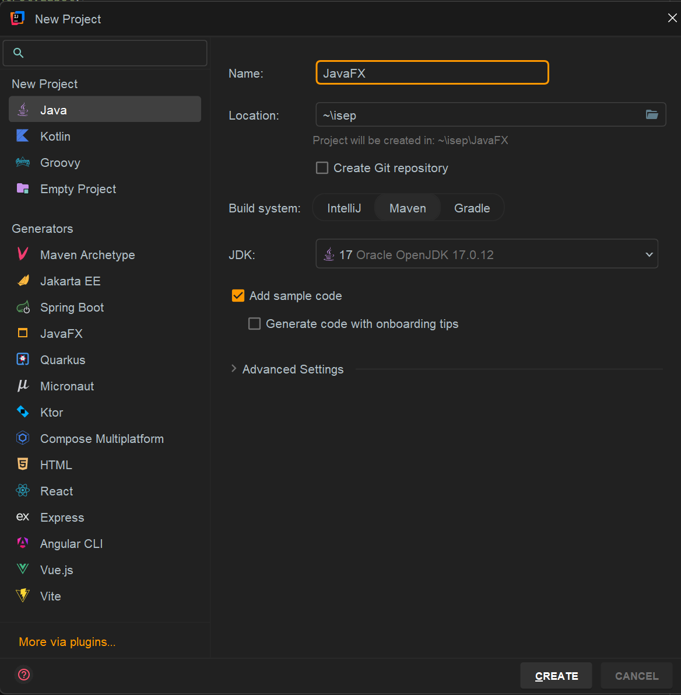
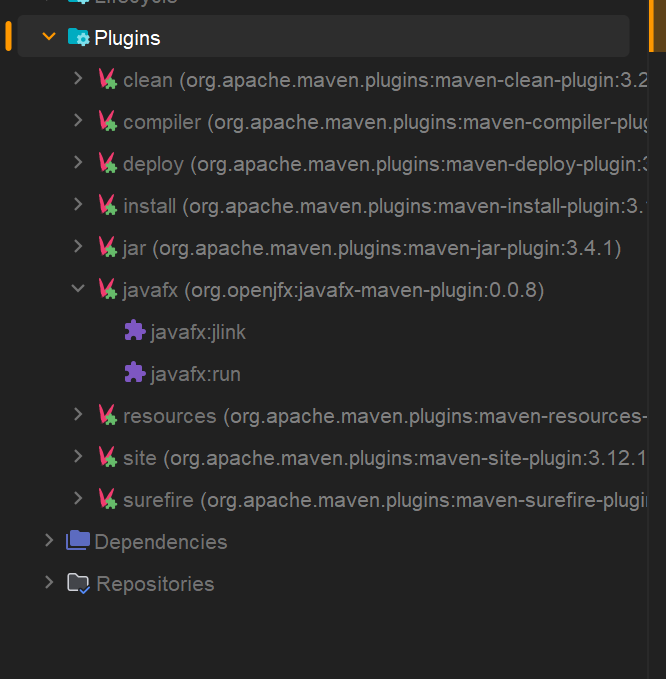
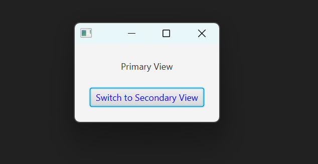
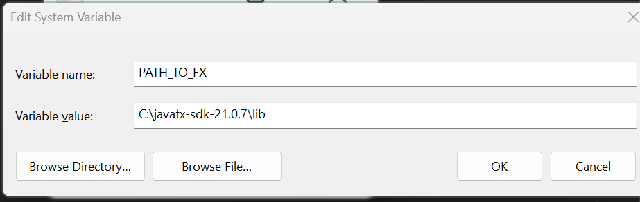
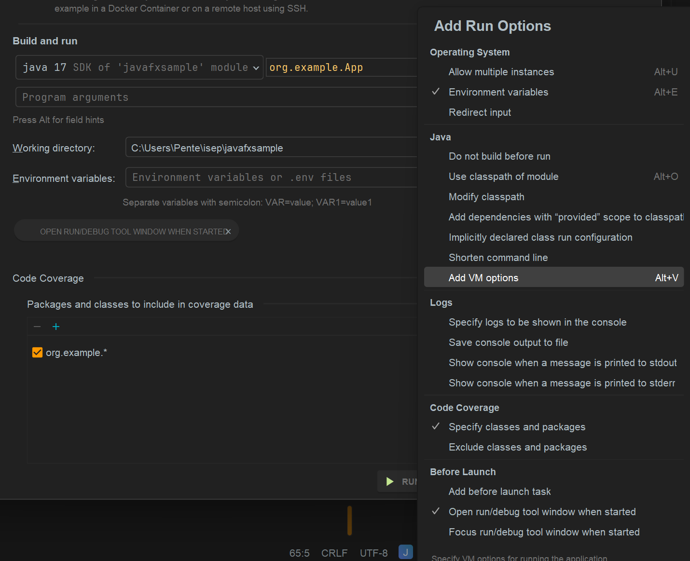
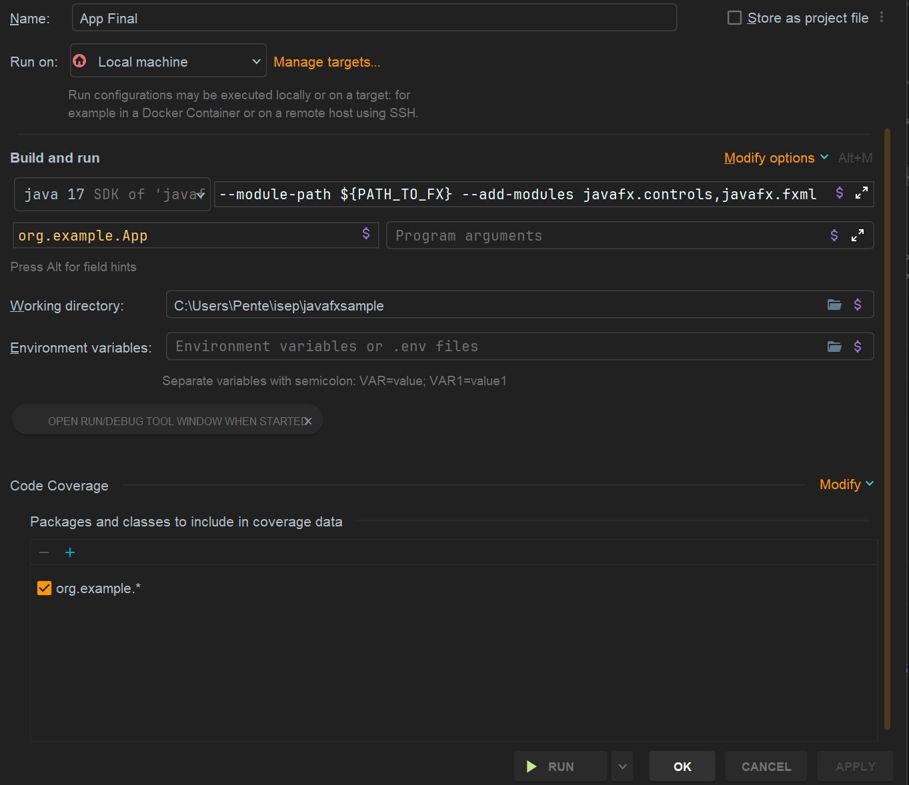

# How to Include JAVAFX into a maven project

==============================================

## Create a simple maven project with java

==============================================

First create a simple java maven project pointing to the correct JDK



To include JavaFx libraries it's required to include the dependencies into the maven project -> POM.xml

>  
    <dependency>
        <groupId>org.openjfx</groupId>
        <artifactId>javafx-controls</artifactId>
        <version>${javafx.version}</version>
    </dependency>
    <dependency>
        <groupId>org.openjfx</groupId>
        <artifactId>javafx-fxml</artifactId>
        <version>${javafx.version}</version>
    </dependency>

The ${javafx.version} will depend on the Java JDK installed
You could check here which version you should include -> [JavaFX according with Java JDK](https://gluonhq.com/products/javafx/)
- for the Java JDK 17 you can use JavaFX 21

Now the libraries can be imported into the project but still is not runnable.
If the project is started in the APP application it will miss the libraries of JavaFx

To solve that problem is required to enter this build phase to tell the java application to start from the App class and include those jars.

>
    <build>
        <plugins>
            ...
            <plugin>
                <groupId>org.openjfx</groupId>
                <artifactId>javafx-maven-plugin</artifactId>
                <version>${javafx.maven.plugin.version}</version>
                <configuration>
                    <mainClass>org.example.App</mainClass>
                </configuration>
            </plugin>
        </plugins>
    </build>

In the right side of the IDE (in this case Intellij) its added a new build phase of JavaFx and should be the one to be triggered to build and run correctly the application


Then, after hitting the ``` javafx:run ```  the application should appear a new windows in the operating system


## How to debug/run without maven

Even though its configured on maven, when hitting the run arrow in the IDE it's not able to run it, its required to tell the JVM that needs to include those dependencies (JavaFX).
In order to be able to run/debug it from the IDE its required to download/point the location of the JavaFx libraries in the local pc
- I suggest to download the JavaFx SDK from the [JavaFx](https://gluonhq.com/products/javafx/) website  and extract it into a folder
- Then create an environmental variable called PATH_TO_FX that should be pointed to the lib folder of the extracted JavaFX
    - 
- Now in the IDE it's required to add instructions to add the JavaFx binaries in runtime
  - Click on Modifiy options -> Add VM Options 
- A new InputBox will appear and now its possible to include those binaries into the JVM run process
  - 
  - ```--module-path ${PATH_TO_FX} --add-modules javafx.controls,javafx.fxml```
- Now its only press Run or Debug!


Note: any specific doubt please contact me via tmp@isep.ipp.pt or check the example project in the src folder!


